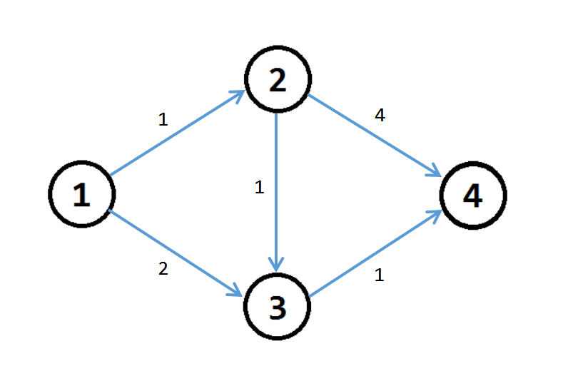
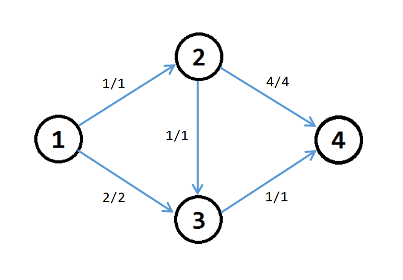
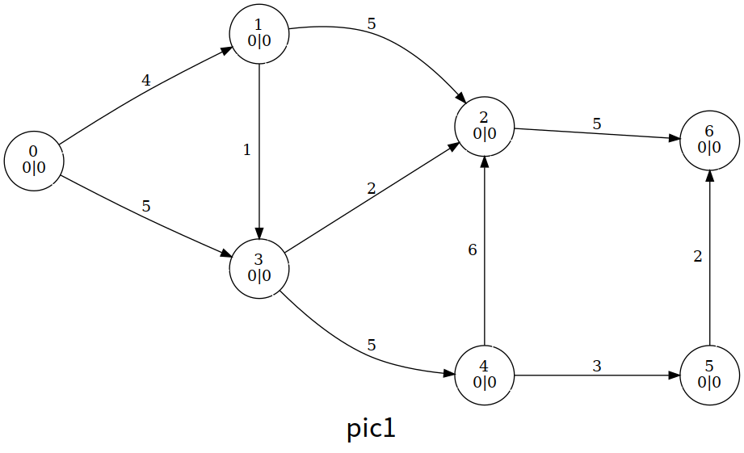
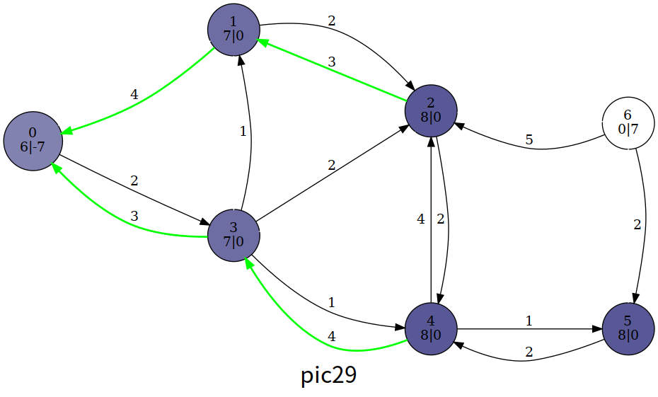
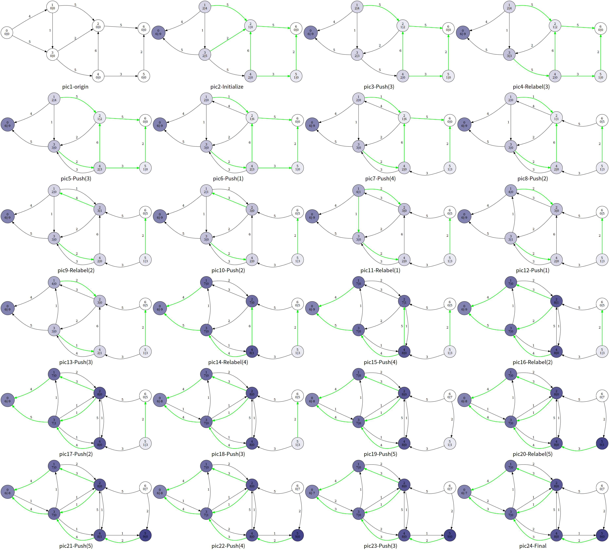

网络流基本概念参见 [网络流简介](https://oi-wiki.org/graph/flow/) 

## 概述

我们有一张图，要求从源点流向汇点的最大流量（可以有很多条路到达汇点），就是我们的最大流问题。

## Ford-Fulkerson 增广路算法

该方法通过寻找增广路来更新最大流，有 EK,dinic,SAP,ISAP 主流算法。

求解最大流之前，我们先认识一些概念。

### 残量网络

首先我们介绍一下一条边的剩余容量 $c_f(u,v)$ （Residual Capacity），它表示的是这条边的容量与流量之差，即 $c_f(u,v)=c(u,v)-f(u,v)$ 。

对于流函数 $f$ ，残存网络 $G_f$ （Residual Network）是网络 $G$ 中所有结点 **和剩余容量大于 0** 的边构成的子图。形式化的定义，即 $G_f=(V_f=V,E_f=\left\{(u,v)\in E,c_f(u,v)>0\right\})$ 。

注意，剩余容量大于 0 的边可能不在原图 $G$ 中（根据容量、剩余容量的定义以及流函数的斜对称性得到）。可以理解为，残量网络中包括了那些还剩了流量空间的边构成的图，也包括虚边（即反向边）。

### 増广路

在原图 $G$ 中若一条从源点到汇点的路径上所有边的 **剩余容量都大于 0** ，这条路被称为增广路（Augmenting Path）。

或者说，在残存网络 $G_f$ 中，一条从源点到汇点的路径被称为增广路。如图：



我们从 $4$ 到 $3$ ，肯定可以先从流量为 $20$ 的这条边先走。那么这条边就被走掉了，不能再选，总的流量为 $20$ （现在）。然后我们可以这样选择：

1.   $4\rightarrow2\rightarrow3$ 这条 **增广路** 的总流量为 $20$ 。到 $2$ 的时候还是 $30$ ，到 $3$ 了就只有 $20$ 了。

2.   $4\rightarrow2\rightarrow1\rightarrow3$ 这样子我们就很好的保留了 $30$ 的流量。

所以我们这张图的最大流就应该是 $20+30=50$ 。

求最大流是很简单的，接下来讲解求最大流的 3 种方法。

### Edmond-Karp 动能算法（EK 算法）

这个算法很简单，就是 BFS **找增广路** ，然后对其进行 **增广** 。你可能会问，怎么找？怎么增广？

1.  找？我们就从源点一直 BFS 走来走去，碰到汇点就停，然后增广（每一条路都要增广）。我们在 BFS 的时候就注意一下流量合不合法就可以了。

2.  增广？其实就是按照我们找的增广路在重新走一遍。走的时候把这条路的能够成的最大流量减一减，然后给答案加上最小流量就可以了。

再讲一下 **反向边** 。增广的时候要注意建造反向边，原因是这条路不一定是最优的，这样子程序可以进行反悔。假如我们对这条路进行增广了，那么其中的每一条边的反向边的流量就是它的流量。



讲一下一些小细节。如果你是用邻接矩阵的话，反向边直接就是从 $table[x,y]$ 变成 $table[y,x]$ 。如果是常用的链式前向星，那么在加入边的时候就要先加入反向边。那么在用的时候呢，我们直接 $i\operatorname{xor}1$ 就可以了 ( $i$ 为边的编号）。为什么呢？相信大家都是知道 $\operatorname{xor}$ 的，那么我们在加入正向边后加入反向边，就是靠近的，所以可以使用 $\operatorname{xor}$ 。我们还要注意一开始的编号要设置为 $tot=1$ ，因为边要从编号 $2$ 开始，这样子 $\operatorname{xor}$ 对编号 $2,3$ 的边才有效果。

EK 算法的时间复杂度为 $O(n^2m)$ （其中 $n$ 为点数， $m$ 为边数）。效率还有很大提升空间。

```cpp
#define maxn 250
#define INF 0x3f3f3f3f

struct Edge {
  int from, to, cap, flow;
  Edge(int u, int v, int c, int f) : from(u), to(v), cap(c), flow(f) {}
};

struct EK {
  int n, m;
  vector<Edge> edges;
  vector<int> G[maxn];
  int a[maxn], p[maxn];

  void init(int n) {
    for (int i = 0; i < n; i++) G[i].clear();
    edges.clear();
  }

  void AddEdge(int from, int to, int cap) {
    edges.push_back(Edge(from, to, cap, 0));
    edges.push_back(Edge(to, from, 0, 0));
    m = edges.size();
    G[from].push_back(m - 2);
    G[to].push_back(m - 1);
  }

  int Maxflow(int s, int t) {
    int flow = 0;
    for (;;) {
      memset(a, 0, sizeof(a));
      queue<int> Q;
      Q.push(s);
      a[s] = INF;
      while (!Q.empty()) {
        int x = Q.front();
        Q.pop();
        for (int i = 0; i < G[x].size(); i++) {
          Edge& e = edges[G[x][i]];
          if (!a[e.to] && e.cap > e.flow) {
            p[e.to] = G[x][i];
            a[e.to] = min(a[x], e.cap - e.flow);
            Q.push(e.to);
          }
        }
        if (a[t]) break;
      }
      if (!a[t]) break;
      for (int u = t; u != s; u = edges[p[u]].from) {
        edges[p[u]].flow += a[t];
        edges[p[u] ^ 1].flow -= a[t];
      }
      flow += a[t];
    }
    return flow;
  }
};
```

### Dinic 算法

 **Dinic 算法** 的过程是这样的：每次增广前，我们先用 BFS 来将图分层。设源点的层数为 $0$ ，那么一个点的层数便是它离源点的最近距离。

通过分层，我们可以干两件事情：

1.  如果不存在到汇点的增广路（即汇点的层数不存在），我们即可停止增广。
2.  确保我们找到的增广路是最短的。（原因见下文）

接下来是 DFS 找增广路的过程。

我们每次找增广路的时候，都只找比当前点层数多 $1$ 的点进行增广（这样就可以确保我们找到的增广路是最短的）。

Dinic 算法有两个优化：

1.   **多路增广** ：每次找到一条增广路的时候，如果残余流量没有用完怎么办呢？我们可以利用残余部分流量，再找出一条增广路。这样就可以在一次 DFS 中找出多条增广路，大大提高了算法的效率。
2.   **当前弧优化** ：如果一条边已经被增广过，那么它就没有可能被增广第二次。那么，我们下一次进行增广的时候，就可以不必再走那些已经被增广过的边。

设点数为 $n$ ，边数为 $m$ ，那么 Dinic 算法的时间复杂度是 $O(n^{2}m)$ ，在稀疏图上效率和 EK 算法相当，但在稠密图上效率要比 EK 算法高很多。

特别地，在求解二分图最大匹配问题时，可以证明 Dinic 算法的时间复杂度是 $O(m\sqrt{n})$ 。

```cpp
#define maxn 250
#define INF 0x3f3f3f3f

struct Edge {
  int from, to, cap, flow;
  Edge(int u, int v, int c, int f) : from(u), to(v), cap(c), flow(f) {}
};

struct Dinic {
  int n, m, s, t;
  vector<Edge> edges;
  vector<int> G[maxn];
  int d[maxn], cur[maxn];
  bool vis[maxn];

  void init(int n) {
    for (int i = 0; i < n; i++) G[i].clear();
    edges.clear();
  }

  void AddEdge(int from, int to, int cap) {
    edges.push_back(Edge(from, to, cap, 0));
    edges.push_back(Edge(to, from, 0, 0));
    m = edges.size();
    G[from].push_back(m - 2);
    G[to].push_back(m - 1);
  }

  bool BFS() {
    memset(vis, 0, sizeof(vis));
    queue<int> Q;
    Q.push(s);
    d[s] = 0;
    vis[s] = 1;
    while (!Q.empty()) {
      int x = Q.front();
      Q.pop();
      for (int i = 0; i < G[x].size(); i++) {
        Edge& e = edges[G[x][i]];
        if (!vis[e.to] && e.cap > e.flow) {
          vis[e.to] = 1;
          d[e.to] = d[x] + 1;
          Q.push(e.to);
        }
      }
    }
    return vis[t];
  }

  int DFS(int x, int a) {
    if (x == t || a == 0) return a;
    int flow = 0, f;
    for (int& i = cur[x]; i < G[x].size(); i++) {
      Edge& e = edges[G[x][i]];
      if (d[x] + 1 == d[e.to] && (f = DFS(e.to, min(a, e.cap - e.flow))) > 0) {
        e.flow += f;
        edges[G[x][i] ^ 1].flow -= f;
        flow += f;
        a -= f;
        if (a == 0) break;
      }
    }
    return flow;
  }

  int Maxflow(int s, int t) {
    this->s = s;
    this->t = t;
    int flow = 0;
    while (BFS()) {
      memset(cur, 0, sizeof(cur));
      flow += DFS(s, INF);
    }
    return flow;
  }
};
```

### ISAP

这个是 SAP 算法的加强版 (Improved)。

```cpp
struct Edge {
  int from, to, cap, flow;
  Edge(int u, int v, int c, int f) : from(u), to(v), cap(c), flow(f) {}
};

bool operator<(const Edge& a, const Edge& b) {
  return a.from < b.from || (a.from == b.from && a.to < b.to);
}

struct ISAP {
  int n, m, s, t;
  vector<Edge> edges;
  vector<int> G[maxn];
  bool vis[maxn];
  int d[maxn];
  int cur[maxn];
  int p[maxn];
  int num[maxn];

  void AddEdge(int from, int to, int cap) {
    edges.push_back(Edge(from, to, cap, 0));
    edges.push_back(Edge(to, from, 0, 0));
    m = edges.size();
    G[from].push_back(m - 2);
    G[to].push_back(m - 1);
  }

  bool BFS() {
    memset(vis, 0, sizeof(vis));
    queue<int> Q;
    Q.push(t);
    vis[t] = 1;
    d[t] = 0;
    while (!Q.empty()) {
      int x = Q.front();
      Q.pop();
      for (int i = 0; i < G[x].size(); i++) {
        Edge& e = edges[G[x][i] ^ 1];
        if (!vis[e.from] && e.cap > e.flow) {
          vis[e.from] = 1;
          d[e.from] = d[x] + 1;
          Q.push(e.from);
        }
      }
    }
    return vis[s];
  }

  void init(int n) {
    this->n = n;
    for (int i = 0; i < n; i++) G[i].clear();
    edges.clear();
  }

  int Augment() {
    int x = t, a = INF;
    while (x != s) {
      Edge& e = edges[p[x]];
      a = min(a, e.cap - e.flow);
      x = edges[p[x]].from;
    }
    x = t;
    while (x != s) {
      edges[p[x]].flow += a;
      edges[p[x] ^ 1].flow -= a;
      x = edges[p[x]].from;
    }
    return a;
  }

  int Maxflow(int s, int t) {
    this->s = s;
    this->t = t;
    int flow = 0;
    BFS();
    memset(num, 0, sizeof(num));
    for (int i = 0; i < n; i++) num[d[i]]++;
    int x = s;
    memset(cur, 0, sizeof(cur));
    while (d[s] < n) {
      if (x == t) {
        flow += Augment();
        x = s;
      }
      int ok = 0;
      for (int i = cur[x]; i < G[x].size(); i++) {
        Edge& e = edges[G[x][i]];
        if (e.cap > e.flow && d[x] == d[e.to] + 1) {
          ok = 1;
          p[e.to] = G[x][i];
          cur[x] = i;
          x = e.to;
          break;
        }
      }
      if (!ok) {
        int m = n - 1;
        for (int i = 0; i < G[x].size(); i++) {
          Edge& e = edges[G[x][i]];
          if (e.cap > e.flow) m = min(m, d[e.to]);
        }
        if (--num[d[x]] == 0) break;
        num[d[x] = m + 1]++;
        cur[x] = 0;
        if (x != s) x = edges[p[x]].from;
      }
    }
    return flow;
  }
};
```

## Push-Relabel 预流推进算法

该方法在求解过程中忽略流守恒性，并每次对一个结点更新信息，以求解最大流

有 HLPP 的主流算法

推送 - 重贴标签算法通过对单个结点的更新操作，直到没有结点需要更新来求解最大流

算法过程维护的流函数不一定保持流守恒性，对于一个结点，我们允许进入结点的流超过流出结点的流，超过的部分被称为结点 $u(u\in V-\{s,t\})$ 的 **超额流**  $e(u)$ ：

$$
e(u)=\sum_{(x,u)\in E}f(x,u)-\sum_{(u,y)\in E}f(u,y)
$$

若 $e(u)>0$ ，称结点 $u$  **溢出** .

推送 - 重贴标签算法维护每个结点的高度 $h(u)$ ，并且规定溢出的结点 $u$ 如果要推送超额流，只能向高度小于 $u$ 的结点推送；如果 $u$ 没有相邻的高度小于 $u$ 的结点，就修改 $u$ 的高度（重贴标签）。

#### 高度函数

准确地说，推送 - 重贴标签维护以下的一个映射 $h:V\to \mathbf{N}$ ：

-    $h(s)=|V|,h(t)=0$ 
-    $\forall (u,v)\in E_f,h(u)\leq h(v)+1$ 

则称 $h$ 是残存网络 $G_f=(V_f,E_f)$ 的高度函数。

引理 1：设 $G_f$ 上的高度函数为 $h$ ，对于任意两个结点 $u,v\in V$ ，如果 $h(u)>h(v)+1$ ，则 $(u,v)$ 不是 $G_f$ 中的边。

算法只会在 $h(u)=h(v)+1$ 的边执行推送。

#### 推送 -Push

适用条件：结点 $u$ 溢出，且存在结点 $v((u,v)\in V_f,c(u,v)-f(u,v)>0,h(u)=h(v)+1)$ ，则 push 操作适用于 $(u,v)$ 。

于是，我们尽可能将超额流从 $u$ 推送到 $v$ ，推送过程中我们只关心超额流和 $c(u,v)-f(u,v)$ 的最小值，不关心 $v$ 是否溢出。

如果 $(u,v)$ 在推送完之后满流，将其从残存网络中删除。

#### 重贴标签 -Relabel

适用条件：如果结点 $u$ 溢出，且 $\forall (u,v)\in E_f,h(u)\leq h(v)$ ，则 relabel 操作适用于 $u$ 。

则将 $h(u)$ 更新为 $min_{(u,v)\in E_f}h(v)+1$ 即可。

#### 初始化

$$
\begin{split}
&\forall (u,v)\in E,&f(u,v)=\left\{\begin{split}
&c(u,v)&,u=s\\
&0&,u\neq s\\
\end{split}\right.
\\
&\forall u\in V,&h(u)=\left\{\begin{split}
&|V|&,u=s\\
&0&,u\neq s\\
\end{split}\right.
,e(u)=\sum_{(x,u)\in E}f(x,u)-\sum_{(u,y)\in E}f(u,y)
\end{split}
$$

上述将 $(s,v)\in E$ 充满流，并将 $h(s)$ 抬高，使得 $(s,v)\notin E_f$ ，因为 $h(s)>h(v)$ ，而且 $(s,v)$ 毕竟满流，没必要留在残存网络中；上述还将 $e(s)$ 初始化为 $\sum_{(s,v)\in E}f(s,v)$ 的相反数。

#### 通用执行框架

无需按照特定顺序，执行以下过程：

-   只要存在结点 $u$ 满足 push 或 relabel 的条件，就执行对应的操作。

如图，每个结点中间表示编号，左下表示高度值 $h(u)$ ，右下表示超额流 $e(u)$ ，结点颜色的深度也表示结点的高度；边权表示 $c(u,v)-f(u,v)$ ，绿色的边表示满足 $h(u)=h(v)+1$ 的边 $(u,v)$ （即残存网络的边 $E_f$ ）：



整个算法我们大致浏览一下过程，这里笔者使用的是一个暴力算法，即暴力扫描是否有溢出的结点，有就更新


最后的结果



可以发现，最后的超额流一部分回到了 $s$ ，且除了源点汇点，其他结点都没有溢出；这时的流函数 $f$ 满足流守恒性，为最大流，即 $e(t)$ 。

#### 核心代码

```cpp
const int N = 1e4 + 4, M = 1e5 + 5, INF = 0x3f3f3f3f;
int n, m, s, t, maxflow, tot;
int ht[N], ex[N];
void init() {  // 初始化
  for (int i = h[s]; i; i = e[i].nex) {
    const int &v = e[i].t;
    ex[v] = e[i].v, ex[s] -= ex[v], e[i ^ 1].v = e[i].v, e[i].v = 0;
  }
  ht[s] = n;
}
bool push(int ed) {
  const int &u = e[ed ^ 1].t, &v = e[ed].t;
  int flow = min(ex[u], e[ed].v);
  ex[u] -= flow, ex[v] += flow, e[ed].v -= flow, e[ed ^ 1].v += flow;
  return ex[u];  // 如果 u 仍溢出，返回 1
}
void relabel(int u) {
  ht[u] = INF;
  for (int i = h[u]; i; i = e[i].nex)
    if (e[i].v) ht[u] = min(ht[u], ht[e[i].t]);
  ++ht[u];
}
```

### HLPP 算法

最高标号预流推进算法（High Level Preflow Push）是基于推送 - 重贴标签算法的优先队列实现，该算法优先推送高度高的溢出的结点，算法算法复杂度 $O(n^2\sqrt m)$ 。

具体地说，HLPP 维护以下过程：

1.  初始化（基于推送 - 重贴标签算法）；
2.  选择溢出结点（除 $s,t$ ）中高度最高的结点 $u$ ，并对它所有可以推送的边进行推送；
3.  如果 $u$ 仍溢出，对它重贴标签，回到 2；
4.  如果没有溢出的结点，算法结束。

#### BFS 优化

HLPP 的上界为 $O(n^2\sqrt m)$ ，但在使用时卡得比较紧；我们可以在初始化高度的时候进行优化：

具体来说，我们初始化 $h(u)$ 为 $u$ 到 $t$ 的最短距离；特别地， $h(s)=n$ 。

在 BFS 的同时我们顺便检查图的连通性，排除无解的情况。

#### GAP 优化

HLPP 推送的条件是 $h(u)=h(v)+1$ ，而如果在算法的某一时刻， $h(u)=t$ 的结点个数为 $0$ ，那么对于 $h(u)>t$ 的结点就永远无法推送超额流到 $t$ ，因此只能送回 $s$ ，那么我们就在这时直接让他们的高度变成 $n+1$ ，以尽快推送回 $s$ ，减少重贴标签的操作。

#### LuoguP4722【模板】最大流 加强版/预流推进

```cpp
#include <cstdio>
#include <cstring>
#include <queue>
using namespace std;
const int N = 1e4 + 4, M = 2e5 + 5, INF = 0x3f3f3f3f;
int n, m, s, t;

struct qxx {
  int nex, t, v;
};
qxx e[M * 2];
int h[N], cnt = 1;
void add_path(int f, int t, int v) { e[++cnt] = (qxx){h[f], t, v}, h[f] = cnt; }
void add_flow(int f, int t, int v) {
  add_path(f, t, v);
  add_path(t, f, 0);
}

int ht[N], ex[N], gap[N];  // 高度；超额流；gap 优化
bool bfs_init() {
  memset(ht, 0x3f, sizeof(ht));
  queue<int> q;
  q.push(t), ht[t] = 0;
  while (q.size()) {  // 反向 BFS, 遇到没有访问过的结点就入队
    int u = q.front();
    q.pop();
    for (int i = h[u]; i; i = e[i].nex) {
      const int &v = e[i].t;
      if (e[i ^ 1].v && ht[v] > ht[u] + 1) ht[v] = ht[u] + 1, q.push(v);
    }
  }
  return ht[s] != INF;  // 如果图不连通，返回 0
}
struct cmp {
  bool operator()(int a, int b) const { return ht[a] < ht[b]; }
};                                         // 伪装排序函数
priority_queue<int, vector<int>, cmp> pq;  // 将需要推送的结点以高度高的优先
bool vis[N];                               // 是否在优先队列中
int push(int u) {  // 尽可能通过能够推送的边推送超额流
  for (int i = h[u]; i; i = e[i].nex) {
    const int &v = e[i].t, &w = e[i].v;
    if (!w || ht[u] != ht[v] + 1) continue;
    int k = min(w, ex[u]);  // 取到剩余容量和超额流的最小值
    ex[u] -= k, ex[v] += k, e[i].v -= k, e[i ^ 1].v += k;  // push
    if (v != s && v != t && !vis[v])
      pq.push(v), vis[v] = 1;  // 推送之后，v 必然溢出，则入堆，等待被推送
    if (!ex[u]) return 0;  // 如果已经推送完就返回
  }
  return 1;
}
void relabel(int u) {  // 重贴标签（高度）
  ht[u] = INF;
  for (int i = h[u]; i; i = e[i].nex)
    if (e[i].v) ht[u] = min(ht[u], ht[e[i].t]);
  ++ht[u];
}
int hlpp() {                  // 返回最大流
  if (!bfs_init()) return 0;  // 图不连通
  ht[s] = n;
  memset(gap, 0, sizeof(gap));
  for (int i = 1; i <= n; i++)
    if (ht[i] != INF) gap[ht[i]]++;  // 初始化 gap
  for (int i = h[s]; i; i = e[i].nex) {
    const int v = e[i].t, w = e[i].v;  // 队列初始化
    if (!w) continue;
    ex[s] -= w, ex[v] += w, e[i].v -= w, e[i ^ 1].v += w;  // 注意取消 w 的引用
    if (v != s && v != t && !vis[v]) pq.push(v), vis[v] = 1;  // 入队
  }
  while (pq.size()) {
    int u = pq.top();
    pq.pop(), vis[u] = 0;
    while (push(u)) {  // 仍然溢出
      // 如果 u 结点原来所在的高度没有结点了，相当于出现断层
      if (!--gap[ht[u]])
        for (int i = 1; i <= n; i++)
          if (i != s && i != t && ht[i] > ht[u] && ht[i] < n + 1) ht[i] = n + 1;
      relabel(u);
      ++gap[ht[u]];  // 新的高度，更新 gap
    }
  }
  return ex[t];
}
int main() {
  scanf("%d%d%d%d", &n, &m, &s, &t);
  for (int i = 1, u, v, w; i <= m; i++) {
    scanf("%d%d%d", &u, &v, &w);
    add_flow(u, v, w);
  }
  printf("%d", hlpp());
  return 0;
}
```

感受一下运行过程



其中 pic13 到 pic14 执行了 Relabel(4)，并进行了 GAP 优化。
