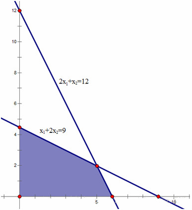
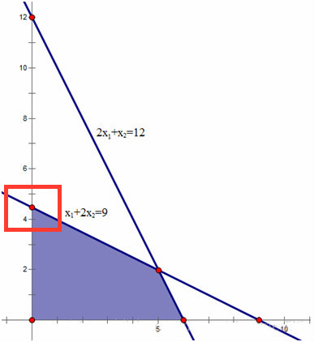
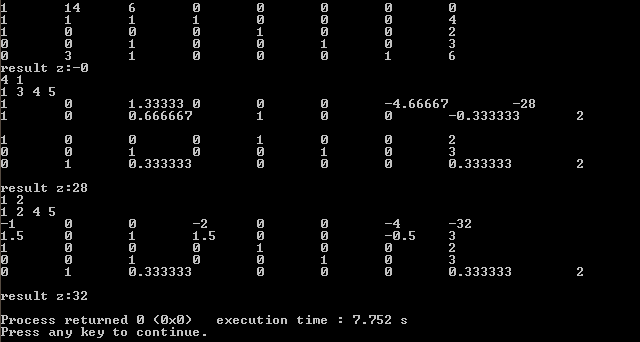

## 作用

单纯形法是解决线性规划问题的一个有效的算法。线性规划就是在一组线性约束条件下，求解目标函数最优解的问题。

## 线性规划的一般形式

在约束条件下，寻找目标函数 $z$ 的最大值：

$$
\max \ z = x_1 + x_2
$$

$$
s.t \begin{cases}  
2x_1 + x_2 \leq 12 \\ 
x_1 + 2x_2 \leq 9  \\
x_1, x_2 \geq 0
\end{cases}
$$

## 线性规划的可行域

满足线性规划问题约束条件的所有点组成的集合就是线性规划的可行域。若可行域有界（以下主要考虑有界可行域），线性规划问题的目标函数最优解必然在可行域的顶点上达到最优。

单纯形法就是通过设置不同的基向量，经过矩阵的线性变换，求得基可行解（可行域顶点），并判断该解是否最优，否则继续设置另一组基向量，重复执行以上步骤，直到找到最优解。所以，单纯形法的求解过程是一个循环迭代的过程。



<center>图1 可行域</center>

## 线性规划的标准形式

在说明单纯形法的原理之前，需要明白线性规划的标准形式。因为单纯形算法是通过线性规划的标准形来求解的。一般，规定线性规划的标准形式为：

$$
\max \ z = \sum_{j = 1}^{n}c_jx_j
$$

$$
s.t \begin{cases}  
\displaystyle \sum_{j = 1}^{n}a_{ij}x_j = b_j, i = 1,2,...,m\\ 
xj \geq 0 , j = 1,2,...,n  \\
\end{cases}
$$

写成矩阵形式：

$$
\max \ z = CX
$$

$$
AX = b
$$

$$
X \geq 0
$$

$$
A = 
\begin{bmatrix}
a_{11} & a_{12} & \ldots & a_{1n}\\
a_{21} & a_{22} & \ldots & a_{2n}\\
\vdots & \vdots & \ddots & \vdots \\
a_{m1} & a_{m2} & \ldots & a_{mn}
\end{bmatrix}
$$

标准形的形式为：

-   1）目标函数要求 $\max$ 

-   2）约束条件均为等式

-   3）决策变量为非负约束

普通线性规划化为标准形：

-   1）若目标函数为最小化，可以通过取负，求最大化
-   2）约束不等式为小于等于不等式，可以在左端加入非负松弛变量，转变为等式，比如：

$$
x_1 + 2x_2 \leq 9 \Rightarrow 
\begin{cases}  
x_1 + 2x_2 + x_3 = 9\\ 
x_3 \geq 0
\end{cases}
$$

同理，约束不等式为大于等于不等式时，可以在左端减去一个非负松弛变量，变为等式。

-   3）若存在取值无约束的变量，可转变为两个非负变量的差，比如：

$$
-\infty \leq x_k \leq +\infty \Rightarrow
\begin{cases}  
x_k = x_m - x_n\\ 
x_m,x_n \geq 0
\end{cases}
$$

本文最开始的线性规划问题转化为标准形为：

$$
max \ z = x_1 + x_2
$$

$$
s.t \begin{cases}  
2x_1 + x_2 + x_3 = 12 \\ 
x_1 + 2x_2 + x_4 = 9  \\
x_1, x_2, x_3, x_4 \geq 0
\end{cases}
$$

## 单纯形法

### 几何意义

在标准形中，有 $m$ 个约束条件（不包括非负约束）， $n$ 个决策变量，且 $n \geq m$ 。首先选取 $m$ 个基变量 $x_j^{'}(j = 1, 2, \ldots, m )$ ，基变量对应约束系数矩阵的列向量线性无关。通过矩阵的线性变换，基变量可由非基变量表示：

$$
x_i^{'} = C_i + \sum_{j = m + 1}^{n}m_{ij}x_j^{'}(i = 1, 2, \ldots , m)
$$

如果令非基变量等于 $0$ ，可求得基变量的值：

$$
x_i^{'} = C_i
$$

如果为可行解的话， $C_i$ 大于 $0$ 。那么它的几何意义是什么呢？

还是通过上述具体的线性规划问题来说明：

$$
\max \ z = x_1 + x_2
$$

$$
s.t \begin{cases}  
2x_1 + x_2 + x_3 = 12 \\ 
x_1 + 2x_2 + x_4 = 9  \\
x_1, x_2, x_3, x_4 \geq 0
\end{cases}
$$

如果选择 $x_2​$ 、 $x_3​$ 为基变量，那么令 $x_1​$ 、 $x_4​$ 等于 $0​$ ，可以去求解基变量 $x_2​$ 、 $x_3​$ 的值。对系数矩阵做行变换，如下所示， $x_2=9/2​$ ， $x_3=15/2​$ 。

$$
\left[\begin{array}{ccccc}{\mathrm{X}} & {x_{1}} & {x_{2}} & {x_{3}} & {x_{4}} & {b} \\ {} & {2} & {1} & {1} & {0} & {12} \\ {} & {1} & {2} & {0} & {1} & {9} \\ {\mathrm{C}} & {1} & {1} & {0} & {0} & {z}\end{array}\right] \rightarrow\left[\begin{array}{ccccc}{\mathrm{X}} & {x_{1}} & {x_{2}} & {x_{3}} & {x_{4}} & {b} \\ {} & {\frac{3}{2}} & {0} & {1} & {-\frac{1}{2}} & {\frac{15}{2}} \\ {} & {\frac{1}{2}} & {1} & {0} & {\frac{1}{2}} & {\frac{9}{2}} \\ {\mathrm{C}} & {\frac{1}{2}} & {0} & {0} & {-\frac{1}{2}} & {z-\frac{9}{2}}\end{array}\right]
$$

 $X_1=0$ 表示可行解在 $x$ 轴上； $X_4=0$ 表示可行解在 $x_1+2x_2=9$ 的直线上。那么，求得的可行解即表示这两条直线的交点，也是可行域的顶点，如图所示：



<center>图2</center>

所以，通过选择不同的基变量，可以获得不同的可行域的顶点。

### 如何判断最优

如前所述，基变量可由非基变量表示：

$$
x_i^{'} = C_i + \sum_{j = m + 1}^{n}m_{ij}x_j^{'}(i = 1, 2, \ldots , m) 
$$

目标函数 $z$ 也可以完全由非基变量表示：

$$
z = z_0 + \sum_{j = m + 1}^{n} \sigma_j x_j^{'}
$$

当达到最优解时，所有的 $\sigma_j$ 应小于等于 $0$ ，当存在 $j$ ， $\sigma_j > 0$ 时，当前解不是最优解，为什么？

当前的目标函数值为 $z_0$ ，其中所有的非基变量值均取 $0$ 。由之前分析可知， $x_j^{'} = 0$ 代表可行域的某个边界，是 $x_j^{'}$ 的最小值。如果可行解逐步离开这个边界， $x_j^{'}$ 会变大，因为 $\sigma_j > 0$ ，显然目标函数的取值也会变大，所以当前解不是最优解。我们需要寻找新的基变量。

### 如何选择新的基变量

如果存在多个 $\sigma_j > 0$ ，选择最大的 $\sigma_j > 0$ 对应的变量作为基变量，这表示目标函数随着 $x_j^{'}$ 的增加，增长的最快。

### 如何选择被替换的基变量

假如我们选择非基变量 $x_s^{'}$ 作为下一轮的基变量，那么被替换基变量 $x_j^{'}$ 在下一轮中作为非基变量，等于 $0$ 。选择 $x_j^{'}$ 的原则：替换后应该尽量使 $x_s^{'}$ 值最大（因为上面已分析过，目标函数会随着 $x_s^{'}$ 的增大而增大）。

继续通过上面的例子来说明：

$$
\left[\begin{array}{ccccc}{\mathrm{X}} & {x_{1}} & {x_{2}} & {x_{3}} & {x_{4}} & {b} \\ {} & {2} & {1} & {1} & {0} & {12} \\ {} & {1} & {2} & {0} & {1} & {9} \\ {\mathrm{C}} & {1} & {1} & {0} & {0} & {z}\end{array}\right] \rightarrow\left[\begin{array}{ccccc}{\mathrm{X}} & {x_{1}} & {x_{2}} & {x_{3}} & {x_{4}} & {b} \\ {} & {\frac{3}{2}} & {0} & {1} & {-\frac{1}{2}} & {\frac{15}{2}} \\ {} & {\frac{1}{2}} & {1} & {0} & {\frac{1}{2}} & {\frac{9}{2}} \\ {\mathrm{C}} & {\frac{1}{2}} & {0} & {0} & {-\frac{1}{2}} & {z-\frac{9}{2}}\end{array}\right]
$$

从最后一行可以看到， $x_1$ 的系数为 $1/2>0$ ，所以选 $x_2$ 、 $x_3$ 为基变量并没有是目标函数达到最优。下一轮选取 $x_1$ 作为基变量，替换 $x_2$ 、 $x_3$ 中的某个变量。

第一行是符号

第二行：若 $x_1$ 替换 $x_3$ 作为基变量， $x_3=0$ 时， $x_1=\dfrac{\dfrac{15}{2}}{\dfrac{3}{2}}=5$ 

第三行：若 $x_1$ 替换 $x_2$ 作为基变量， $x_2=0$ 时， $x_1=\dfrac{\dfrac{9}{2}}{\dfrac{1}{2}}=9$ 

显然，应该把 $x_2$ 作为非基变量。

### 终止条件

当目标函数用非基变量的线性组合表示时，所有的系数均不大于 $0$ ，则表示目标函数达到最优。

如果，有一个非基变量的系数为 $0$ ，其他的均小于 $0$ ，表示目标函数的最优解有无穷多个。这是因为目标函数的梯度与某一边界正交，在这个边界上，目标函数的取值均相等，且为最优。

使用单纯型法来求解线性规划，输入单纯型法的松弛形式，是一个大矩阵，第一行为目标函数的系数，且最后一个数字为当前轴值下的 $z$ 值。下面每一行代表一个约束，数字代表系数每行最后一个数字代表 $b$ 值。

算法和使用单纯性表求解线性规划相同。

对于线性规划问题：

$$
\max \ x_1 + 14x_2 + 6x_3
$$

$$
s.t \begin{cases}  
x_1 + x_2 + x_3 \leq 4 \\ 
x_1 \leq 2  \\
x_3 \leq 3  \\
3x_2 + x_3 \leq 6 \\
x_1, x_2, x_3 \geq 0
\end{cases}
$$

我们可以得到其松弛形式：

$$
\max \ x_1 + 14x_2 + 6x_3
$$

$$
s.t \begin{cases}  
x_1 + x_2 + x_3 + x_4 = 4 \\ 
x_1 + x_5 = 2  \\
x_3 + x_6 = 3  \\
3x_2 + x_3 + x_7 = 6 \\
x_1, x_2, x_3, x_4, x_5, x_6, x_7 \geq 0
\end{cases}
$$

我们可以构造单纯性表，其中最后一行打星的列为轴值。

|  $x_1$    |  $x_2$     |  $x_3$    |  $x_4$    |  $x_5$    |  $x_6$    |  $x_7$    |  $b$     |
| --------- | ---------- | --------- | --------- | --------- | --------- | --------- | -------- |
|  $c_1=1$  |  $c_2=14$  |  $c_3=6$  |  $c_4=0$  |  $c_5=0$  |  $c_6=0$  |  $c_7=0$  |  $-z=0$  |
|  $1$      |  $1$       |  $1$      |  $1$      |  $0$      |  $0$      |  $0$      |  $4$     |
|  $1$      |  $0$       |  $0$      |  $0$      |  $1$      |  $0$      |  $0$      |  $2$     |
|  $0$      |  $0$       |  $1$      |  $0$      |  $0$      |  $1$      |  $0$      |  $3$     |
|  $0$      |  $3$       |  $1$      |  $0$      |  $0$      |  $0$      |  $1$      |  $6$     |
|           |            |           |  $*$      |  $*$      |  $*$      |  $*$      |          |

在单纯性表中，我们发现非轴值的 $x$ 上的系数大于零，因此可以通过增加这些个 $x$ 的值，来使目标函数增加。我们可以贪心的选择最大的 $c$ ，再上面的例子中我们选择 $c_2$ 作为新的轴，加入轴集合中，那么谁该出轴呢？

其实我们由于每个 $x$ 都大于零，对于 $x_2$ 它的增加是有所限制的，如果 $x_2$ 过大，由于其他的限制条件，就会使得其他的 $x$ 小于零，于是我们应该让 $x_2$ 一直增大，直到有一个其他的 $x$ 刚好等于 $0$ 为止，那么这个 $x$ 就被换出轴。

我们可以发现，对于约束方程 $1$ ，即第一行约束， $x_2$ 最大可以为 $4$ （ $4/1$ ），对于约束方程 $4$ ， $x_2$ 最大可以为 $2$ （ $6/3$ ），因此 $x_2$ 最大只能为他们之间最小的那个，这样才能保证每个 $x$ 都大于零。因此使用第 $4$ 行，来对各行进行高斯行变换，使得第二列第四行中的每个 $x$ 都变成零，也包括 $c_2$ 。这样我们就完成了把 $x_2$ 入轴， $x_7$ 出轴的过程。变换后的单纯性表为：

|  $x_1$    |  $x_2$    |  $x_3$       |  $x_4$    |  $x_5$    |  $x_6$    |  $x_7$        |  $b$       |
| --------- | --------- | ------------ | --------- | --------- | --------- | ------------- | ---------- |
|  $c_1=1$  |  $c_2=0$  |  $c_3=1.33$  |  $c_4=0$  |  $c_5=0$  |  $c_6=0$  |  $c_7=-4.67$  |  $-z=-28$  |
|  $1$      |  $0$      |  $0.67$      |  $1$      |  $0$      |  $0$      |  $-0.33$      |  $2$       |
|  $1$      |  $0$      |  $0$         |  $0$      |  $1$      |  $0$      |  $0$          |  $2$       |
|  $0$      |  $0$      |  $1$         |  $0$      |  $0$      |  $1$      |  $0$          |  $3$       |
|  $0$      |  $1$      |  $0.33$      |  $0$      |  $0$      |  $0$      |  $0.33$       |  $2$       |
|           |  $*$      |              |  $*$      |  $*$      |  $*$      |               |            |

继续计算，我们得到：

|  $x_1$     |  $x_2$    |  $x_3$    |  $x_4$    |  $x_5$     |  $x_6$    |  $x_7$    |  $b$       |
| ---------- | --------- | --------- | --------- | ---------- | --------- | --------- | ---------- |
|  $c_1=-1$  |  $c_2=0$  |  $c_3=0$  |  $c_4=0$  |  $c_5=-2$  |  $c_6=0$  |  $c_7=0$  |  $-z=-32$  |
|  $1.5$     |  $0$      |  $1$      |  $1.5$    |  $0$       |  $0$      |  $-0.5$   |  $3$       |
|  $1$       |  $0$      |  $0$      |  $0$      |  $1$       |  $0$      |  $0$      |  $2$       |
|  $0$       |  $0$      |  $1$      |  $0$      |  $0$       |  $1$      |  $0$      |  $3$       |
|  $0$       |  $1$      |  $0.33$   |  $0$      |  $0$       |  $0$      |  $0.33$   |  $2$       |
|            |  $*$      |           |  $*$      |  $*$       |  $*$      |           |            |

此时我们发现，所有非轴的 $x$ 的系数全部小于零，即增大任何非轴的 $x$ 值并不能使得目标函数最大，从而得到最优解 $32$ 。

整个过程代码如下所示：

```c++
#include <bits/stdc++.h>
using namespace std;
vector<vector<double> > Matrix;
double Z;
set<int> P;
size_t cn, bn;

bool Pivot(pair<size_t, size_t> &p) {  //返回0表示所有的非轴元素都小于0
  int x = 0, y = 0;
  double cmax = -INT_MAX;
  vector<double> C = Matrix[0];
  vector<double> B;

  for (size_t i = 0; i < bn; i++) {
    B.push_back(Matrix[i][cn - 1]);
  }

  for (size_t i = 0; i < C.size(); i++) {  //在非轴元素中找最大的c
    if (cmax < C[i] && P.find(i) == P.end()) {
      cmax = C[i];
      y = i;
    }
  }
  if (cmax < 0) {
    return 0;
  }

  double bmin = INT_MAX;
  for (size_t i = 1; i < bn; i++) {
    double tmp = B[i] / Matrix[i][y];
    if (Matrix[i][y] != 0 && bmin > tmp) {
      bmin = tmp;
      x = i;
    }
  }

  p = make_pair(x, y);

  for (set<int>::iterator it = P.begin(); it != P.end(); it++) {
    if (Matrix[x][*it] != 0) {
      // cout<<"erase "<<*it<<endl;
      P.erase(*it);
      break;
    }
  }
  P.insert(y);
  // cout<<"add "<<y<<endl;
  return true;
}

void pnt() {
  for (size_t i = 0; i < Matrix.size(); i++) {
    for (size_t j = 0; j < Matrix[0].size(); j++) {
      cout << Matrix[i][j] << "\t";
    }
    cout << endl;
  }
  cout << "result z:" << -Matrix[0][cn - 1] << endl;
}

void Gaussian(pair<size_t, size_t> p) {  //行变换
  size_t x = p.first;
  size_t y = p.second;
  double norm = Matrix[x][y];
  for (size_t i = 0; i < cn; i++) {  //主行归一化
    Matrix[x][i] /= norm;
  }
  for (size_t i = 0; i < bn && i != x; i++) {
    if (Matrix[i][y] != 0) {
      double tmpnorm = Matrix[i][y];
      for (size_t j = 0; j < cn; j++) {
        Matrix[i][j] = Matrix[i][j] - tmpnorm * Matrix[x][j];
      }
    }
  }
}

void solve() {
  pair<size_t, size_t> t;
  while (1) {
    pnt();
    if (Pivot(t) == 0) {
      return;
    }
    cout << t.first << " " << t.second << endl;
    for (set<int>::iterator it = P.begin(); it != P.end(); it++) {
      cout << *it << " ";
    }
    cout << endl;
    Gaussian(t);
  }
}

int main(int argc, char *argv[]) {
  // ifstream fin;
  // fin.open("./test");
  cin >> cn >> bn;
  for (size_t i = 0; i < bn; i++) {
    vector<double> vectmp;
    for (size_t j = 0; j < cn; j++) {
      double tmp = 0;
      cin >> tmp;
      vectmp.push_back(tmp);
    }
    Matrix.push_back(vectmp);
  }

  for (size_t i = 0; i < bn - 1; i++) {
    P.insert(cn - i - 2);
  }
  solve();
}
/////////////////////////////////////
// glpk input:
///* Variables */
// var x1 >= 0;
// var x2 >= 0;
// var x3 >= 0;
///* Object function */
// maximize z: x1 + 14*x2 + 6*x3;
///* Constrains */
// s.t. con1: x1 + x2 + x3 <= 4;
// s.t. con2: x1  <= 2;
// s.t. con3: x3  <= 3;
// s.t. con4: 3*x2 + x3  <= 6;
// end;
/////////////////////////////////////
// myinput:
/*
8 5
1 14 6 0 0 0 0 0
1 1 1 1 0 0 0 4
1 0 0 0 1 0 0 2
0 0 1 0 0 1 0 3
0 3 1 0 0 0 1 6
*/
/////////////////////////////////////
```

结果如下：



## 理论罗列

### 标准型

 $m+n$ 个约束 $n$ 个变量用 $x$ 向量表示， $A$ 是一个 $m\times n$ 的矩阵， $c$ 是一个 $n$ 的向量， $b$ 是一个 $m$ 的向量，最大化 $cx$ 满足约束 $Ax \leq b,x > 0$ 。

最大化 $\sum_{j=1}^nc_jx_j$ 满足如下约束条件：

$$
\sum_{j = 1}^na_{ij}x_j \leq b_i,i = 1,2,\ldots,m
$$

$$
x_j \geq 0,j = 1,2,\ldots,n
$$

 $n$ 个变量， $m+n$ 个约束，构造 $m * n$ 的矩阵 $A$ ， $m$ 维向量 $b$ ， $n$ 维向量 $c$ 

最大化 $C^Tx$ 满足如下约束条件：

$$
Ax \leq b
$$

$$
x \geq 0
$$

### 转换为标准型

若目标函数要求取最小值，那么可以对其取相反数变成取最大值。对于限制条件 $f(x_1, x_2, \ldots ,x_n) = b$ ，可以用两个不等式 $f(x_1, x_2, \ldots, x_n) \leq b,-f(x_1,x_2,\ldots,x_n) \leq -b$ 描述，对于限制条件 $f(x_1,x_2,\ldots,x_n) \geq b$ ，可以用不等式 $-f(x_1,x_2,\ldots,x_n) \leq -b$ 描述。对于无限制的变量 $x$ ，可以将其拆为两个非负变量 $x_0,x_1$ ，使得 $x = x_0 - x_1$ 。

### 松弛型

基本变量 $B$ ， $|B|=m$ ，一个约束对应一个，表示松弛量，叫做松弛变量（基本变量）

非基变量 $N$ ， $|N|=n$ ， $x_n + i = b_i - \sum a_{ij}x_j \geq 0$ 

松弛变量 $x_{n+i}$ 

$$
\sum_{j = 1}^na_{ij}x_j \leq b_i \rightarrow x_{n + i} = b_i - \sum_{j = 1}^{n}a_{ij}x_j, x_{n+i} \geq 0
$$

等式左侧为基本变量，右侧为非基本变量。

### 变量

-   替入变量 $x_e$ （非基变量）
-   替出变量 $x_l$ （基本变量）

### 可行解

-   基本解：所有非基变量设为 $0​$ ，基本变量为右侧的常数

-   基本可行解：所有 $b_i \geq 0​$ 

> 注：单纯形法的过程中 B 和 N 不断交换，在 n 维空间中不断走，“相当于不等式上的高斯消元”。

### 转轴

选取一个非基本变量 $x_e​$ 为替入变量，基本变量 $x_l​$ 为替出变量，将其互换，为了防止循环，根据 **Bland 规则** ，选择下标最小的变量。

>  **Bland 规则** 可以参看： [最优化方法](https://github.com/AngelKitty/review_the_national_post-graduate_entrance_examination/blob/master/books_and_notes/professional_courses/data_structures_and_algorithms/sources/extra_books/%E6%9C%80%E4%BC%98%E5%8C%96%E6%96%B9%E6%B3%95.pdf) 

### 初始化

在所有 $b_i < 0$ 的约束中随机选一个作为 $x_l$ ，再随机选一个 $a_{le} < 0$ 作为 $x_e$ ，然后 $pivot(l,e)$ 后 $b_i$ 就变正了。

## 算法实现

每个约束定义了 $n$ 维空间中的一个半空间（超平面），交集形成的可行域是一个凸区域称为单纯型。目标函数是一个超平面，最优解在凸区域定点处取得。通过不断的转轴操作，在 $n$ 维凸区域的顶点上不断移动（转轴），使得基本解的目标值不断变大，最终达到最优解。

> 以下问题可以转换为单纯形：
>
> -   最短路
> -   最大流
> -   最小费用最大流
> -   多商品流

基本思想就是改写 $l$ 这个约束为 $x_e$ 作为基本变量，然后把这个新 $x_e$ 的值带到其他约束和目标函数中，就消去 $x_e$ 了。改写和带入时要修改 $b$ 和 $a$ ，目标函数则是 $c$ 和 $v$ 。

转动时， $l$ 和 $e$ 并没有像算法导论上一样， $a$ 矩阵用了两行分别是 $a_{l, \square}$ 和 $a_{e, \square}$ （这样占用内存大），而是用了同一行，这样 $a$ 矩阵的行数 $=|B|$ ，列数 $=|N|$ 。

也就是说，约束条件只用 $m$ 个，尽管 $B$ 和 $N$ 不断交换，但同一时间还是只有 $m$ 个约束（基本变量）， $n$ 个非基变量，注意改写成松弛型后 $a$ 矩阵实际系数为负。（一个优化为 $a_{i,e}$ 的约束没必要带入了。

 `simplex` 是主过程，基本思想是找到一个 $c_e>0$ 的，然后找对这个 $e$ 限制最紧的 $l$ ，转动这组 $l,e$ ，注意精度控制 $\epsilon$ ， $c_e>\epsilon$ ，还有找 $l$ 的时候 $a_{i,e}>\epsilon​$ 才行。

??? note " 例题[BZOJ1061 志愿者招募](https://www.lydsy.com/JudgeOnline/problem.php?id=1061)"
    题目大意：长度为 $n​$ 的序列，第 $i​$ 位至少 $b_i​$ ， $m​$ 种区间使 $[l_i,r_i] + 1​$ 代价为 $a_i​$ 。

原始问题 $m​$ 个变量， $n​$ 个约束，当 $l_j \leq i \leq r_j​$ ， $a_{ij} = 1​$ 。

对偶问题 $n​$ 个变量， $m​$ 个约束

$$
\max \ \sum_{i=1}nb_iy_i
$$

$$
s.t \ \sum_{l_i \leq j \leq r_i}y_j \leq c_i, y_i \geq 0
$$

把对应出的系数矩阵带入到单纯形算法就可以求出最优解了。

```c++
#include <algorithm>
#include <cmath>
#include <cstdio>
#include <cstring>
#include <iostream>
using namespace std;
typedef long long ll;
const int M = 10005, N = 1005, INF = 1e9;
const double eps = 1e-6;
inline int read() {
  char c = getchar();
  int x = 0, f = 1;
  while (c < '0' || c > '9') {
    if (c == '-') f = -1;
    c = getchar();
  }
  while (c >= '0' && c <= '9') {
    x = x * 10 + c - '0';
    c = getchar();
  }
  return x * f;
}

int n, m;
double a[M][N], b[M], c[N], v;
void pivot(int l, int e) {
  b[l] /= a[l][e];
  for (int j = 1; j <= n; j++)
    if (j != e) a[l][j] /= a[l][e];
  a[l][e] = 1 / a[l][e];

  for (int i = 1; i <= m; i++)
    if (i != l && fabs(a[i][e]) > 0) {
      b[i] -= a[i][e] * b[l];
      for (int j = 1; j <= n; j++)
        if (j != e) a[i][j] -= a[i][e] * a[l][j];
      a[i][e] = -a[i][e] * a[l][e];
    }

  v += c[e] * b[l];
  for (int j = 1; j <= n; j++)
    if (j != e) c[j] -= c[e] * a[l][j];
  c[e] = -c[e] * a[l][e];

  // swap(B[l],N[e])
}

double simplex() {
  while (true) {
    int e = 0, l = 0;
    for (e = 1; e <= n; e++)
      if (c[e] > eps) break;
    if (e == n + 1) return v;
    double mn = INF;
    for (int i = 1; i <= m; i++)
      if (a[i][e] > eps && mn > b[i] / a[i][e]) mn = b[i] / a[i][e], l = i;
    if (mn == INF) return INF;  // unbounded
    pivot(l, e);
  }
}

int main() {
  n = read();
  m = read();
  for (int i = 1; i <= n; i++) c[i] = read();
  for (int i = 1; i <= m; i++) {
    int s = read(), t = read();
    for (int j = s; j <= t; j++) a[i][j] = 1;
    b[i] = read();
  }
  printf("%d", (int)(simplex() + 0.5));
}
```

## 对偶原理

最大化与最小化互换，常数与目标函数互换，改变不等号，变量与约束对应。

$$
\max \ c^T: Ax \leq b, x \geq 0
$$

$$
\min \ b^Ty: A^Ty \geq c, t \geq 0
$$

 $d_{uv}$ 表示 $u,v$ 是否匹配

$$
\max \ \sum_{(u,v) \in E}c_{uv}d_{uv}
$$

$$
s.t \begin{cases}  
\sum_{(v) \in Y} d_{uv} \leq 1, u \in X \\ 
\sum_{(u) \in X} d_{uv} \leq 1, v \in Y  \\
d_{u,v} \in \{0,1\}
\end{cases}
$$

令 $p_u,p_v$ 为两类约束对偶之后的变量

$$
\min \ \sum_{u \in x} p_u + \sum_{v \in Y} p_v
$$

$$
s.t \begin{cases}  
p_u + p_v \geq c_{uv} \\ 
u \in X, v \in Y\\
p_u, p_v \geq 0
\end{cases}
$$

## 全幺模矩阵（Totally Unimodular Matrix)

 **充分条件：** 

-   仅有 $-1,0,1$ 构成

-   每列至多两个非零数

-   行可分为两个集合：
    -   一列包含两个同号非零数，两行不在同一个集合
    -   一列包含两个异号非零数，两行在同一个集合

线性规划中 $A$ 为全幺模矩阵，则单纯形法过程中所有系数 $\in -1,0,1$ ，可以去除系数为 $0$ 的项进行优化！

> 注： **任何最大流、最小费用最大流的线性规划都是全幺模矩阵** 

更多详细的解释参看： <https://www.cnblogs.com/ECJTUACM-873284962/p/7097864.html> 

## 习题练习

-    [UOJ#179. 线性规划](http://uoj.ac/problem/179) 

## 参考资料

-    [线性规划之单纯形法【超详解 + 图解】](https://www.cnblogs.com/ECJTUACM-873284962/p/7097864.html) 
-    [2016 国家集训队论文](https://github.com/OI-wiki/libs/blob/master/%E9%9B%86%E8%AE%AD%E9%98%9F%E5%8E%86%E5%B9%B4%E8%AE%BA%E6%96%87/%E5%9B%BD%E5%AE%B6%E9%9B%86%E8%AE%AD%E9%98%9F2016%E8%AE%BA%E6%96%87%E9%9B%86.pdf) 
-   算法导论
